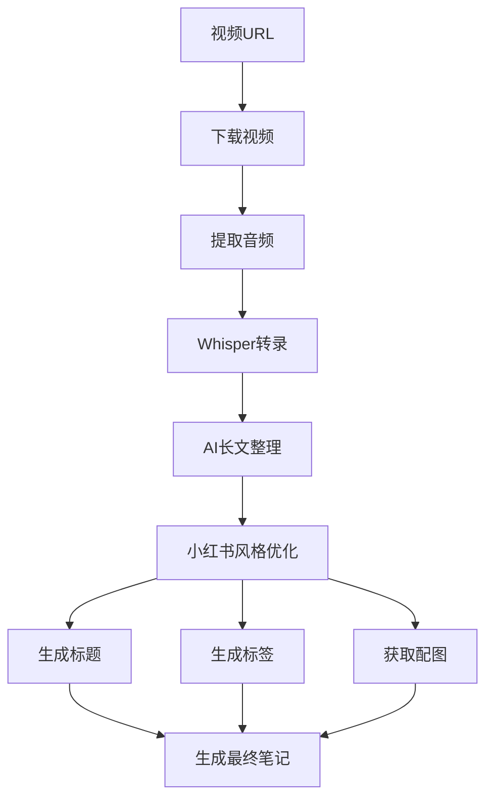

# 小红书笔记生成器 (XHS Note Generator)

🎥 一键将视频转换为优质小红书笔记，自动优化内容和配图


## Huggingface space: [rednote-gen](https://huggingface.co/spaces/windane/rednote-gen)
PS: 最好还是本地运行，Space 直接下载视频失败率高，可以使用MD文件解析。

## 👤 原作者信息

- **作者**：玄清
- **博客**：[天天悦读](https://blog.example.com)
- **Email**：grow8org@gmail.com
- **GitHub**：[whotto/Video_note_generator](https://github.com/whotto/Video_note_generator)


## 🎯 应用场景

- **内容创作者**：快速将视频/直播内容转换为文章
- **知识管理者**：自动整理视频笔记和学习要点
- **社交媒体运营**：批量生成优质小红书笔记

## ✨ 小红书笔记特点

- **标题创作**：
  - 使用二极管标题法，抓住用户痛点
  - 融入高转化词和情感词
  - 添加2-4个相关表情
  - 控制在20字以内

- **内容优化**：
  - 正文控制在600-800字
  - 每段使用emoji引导
  - 设置2-3处互动引导
  - 加入个人经验和共情描述
  - 自动获取相关配图

- **标签系统**：
  - 核心关键词
  - 关联长尾词
  - 高转化标签
  - 热门话题标签

## 🔄 创作流程



## 🚀 使用方式

启动 WebUI:
```shell
$ python web.py
```

打开：http://127.0.0.1:7860

## 🛠️ 使用工具

- [FFmpeg](https://ffmpeg.org/) - 音视频转换
- [Whisper](https://github.com/openai/whisper) - 语音转文字
- [OpenRouter](https://openrouter.ai/) - AI 内容优化
- [Unsplash](https://unsplash.com/) - 高质量图片

## 📦 快速开始

### 1. 安装依赖

```bash
# 安装 FFmpeg
# Mac: brew install ffmpeg
# Windows: 从 ffmpeg.org 下载并添加到环境变量
# Linux: apt install ffmpeg

# 安装 Python 依赖
pip install -r requirements.txt
```

## 📄 输出文件

每个视频会生成三个文件：

1. **原始笔记** ：
   - 完整的视频转录文本
   - 保留所有细节内容

2. **整理版笔记** (`YYYYMMDD_HHMMSS_organized.md`)：
   - AI优化后的结构化内容
   - 重点内容突出
   - 段落优化

3. **小红书版本** (`YYYYMMDD_HHMMSS_xiaohongshu.md`)：
   - 优化的爆款标题
   - 600-800字精华内容
   - 2-3张相关配图
   - 优化的标签系统
   - 互动引导设计

## ⚙️ 配置说明

在设置页面填写必要的 API Key：
- OpenRouter API（必需）
- Unsplash API （建议）

还有其他设置：

```
MAX_TOKENS=2000          # 生成小红书内容的最大长度
CONTENT_CHUNK_SIZE=2000  # 长文本分块大小（字符数）
TEMPERATURE=0.7          # AI 创造性程度 (0.0-1.0)


# 代理设置（可选）
# HTTP_PROXY=http://127.0.0.1:7890
# HTTPS_PROXY=http://127.0.0.1:7890
```

## 📄 许可证

MIT License

## 🙏 鸣谢

感谢以下开源项目：
- [Whisper](https://github.com/openai/whisper)
- [FFmpeg](https://ffmpeg.org/)
